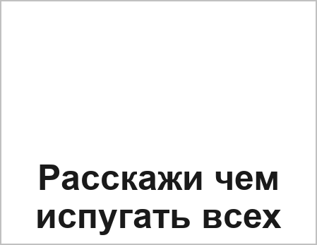
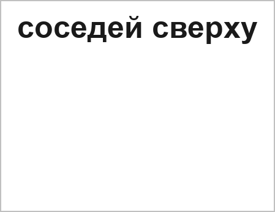
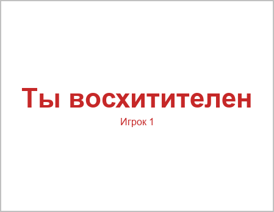
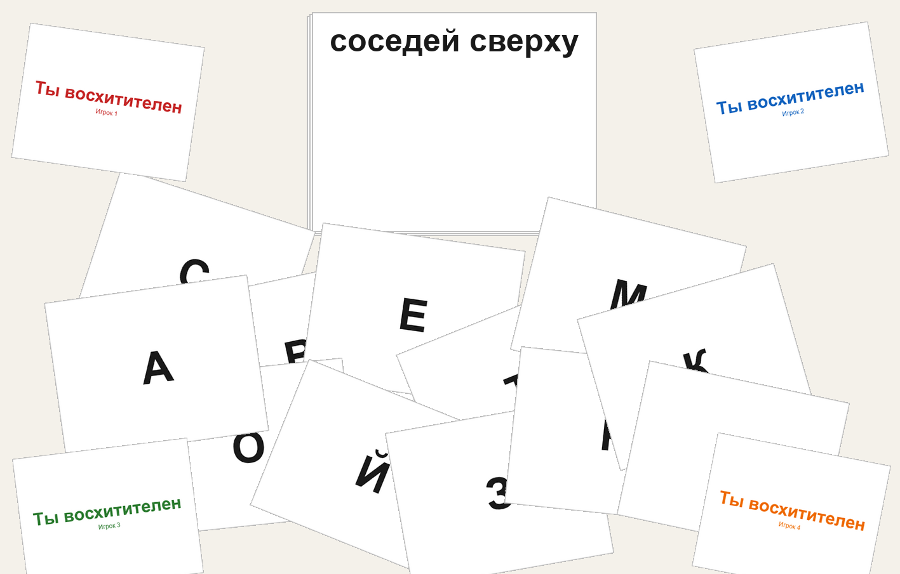

# Свет мой зеркальце

**ПРАВИЛА ИГРЫ**

Контакты автора: yury.yamshchikov@gmail.com

**Длительность партии:** около 30 минут  
**Количество игроков:** 3–6  
**Возраст:** 16+

Вы – гремлины службы поддержки волшебного сервиса «Зеркальце». Клиенты из почти современного мира задают через зеркало странные вопросы, а вы на лету собираете ответы из карт букв, которые берёте из общей кучи в центре стола. Чем смешнее и точнее реакция зала – тем выше шанс забрать карту запроса себе. Побеждает тот, у кого к концу колоды больше всего таких карт.

**Содержание:** взрослый и чёрный юмор, в том числе завуалированные шутки на темы отношений, алкоголя и табака. Политика и религия в материалах игры не используются.

## Комплектация

карты запросов - 14 шт.

карты букв - 72 шт.

карты «Ты восхитителен» - 6 шт. (по 1 каждого цвета)

Элементы, которых нет в PnP, но которые нужны для партии: поверхность стола, достаточная чтобы раскидать карты букв и кидать карты «Ты восхитителен» к игрокам.

## Подготовка к игре

1. Перемешайте колоду запросов и положите её **рубашками вверх**. Верхняя карта колоды показывает вторую половину будущего запроса.
2. Каждый игрок выбирает цвет и берёт карту «Ты восхитителен» своего цвета. Лишние карты «Ты восхитителен» уберите в коробку.
3. Все карты букв раскиньте в случайном порядке **лицом вверх** в центре стола. Руки игроков в начале раунда пустые.

## Ход игры

Набирайте карты запросов как победные очки. Когда колода запросов больше не позволяет начать раунд, побеждает игрок с наибольшим числом таких карт.

Игра идёт **раундами**. Все действия в раунде, кроме возврата карт букв в центр, выполняются **одновременно**, если не сказано иное.

### Как устроена карта запроса

У каждой карты запроса две стороны:

1. **Лицевая сторона** – начало фразы-запроса.
2. **Рубашка** – окончание фразы-запроса.

Рамка зеркала на всех картах одинаковая: при любой перетасовке лицевая сторона одной карты и рубашка следующей сверху в колоде всегда складываются в одно изображение зеркала с целым текстом запроса.

### Раунд

#### 1. Открытие запроса

Снимите верхнюю карту колоды запросов, переверните её **на лицевую сторону** и положите рядом с колодой так, чтобы вместе с **новой** верхней картой колоды (её рубашкой) получилось общее зеркало.

Прочитайте запрос вслух: текст на лицевой карте + текст на рубашке верхней карты колоды.

Если в колоде после переворота осталась меньше одной карты (нечему показать рубашку), раунд не начинается – переходите к окончанию игры.

#### 2. Составление ответа

Игроки одновременно берут карты букв из центра стола и составляют из них ответ на запрос.

- Брать можно **только одной рукой** и **по 1 карте** за раз. Второй рукой можно держать уже взятые карты, но **нельзя копаться** в разложенных на столе картах.
- Каждый берёт карты, пока ему **хватит на ответ**. Лишние карты букв остаются в центре.
- Ответ может быть одним словом или фразой – **на усмотрение игрока** в пределах взятых букв.
- Допускаются несуществующие и неполные слова.
- Любую карту буквы можно сыграть **рубашкой вверх** как джокер (любая буква). Лимита на джокеры нет, но игрок **не озвучивает** замену: слишком много джокеров обычно делает ответ нечитаемым, и такого игрока реже выбирают победителем раунда.
- Несыгранные взятые карты букв остаются у игрока до конца раунда.

Игрок выкладывает свой ответ перед собой на стол, когда готов.

#### 3. Голосование «Ты восхитителен»

В начале этого шага каждый игрок должен держать карту «Ты восхитителен» **в руке** (если карта осталась перед кем-то с прошлого раунда – верните её владельцу в руку).

Все игроки **одновременно** кидают свои карты «Ты восхитителен» так, чтобы карта упала рядом с **другим** игроком. Себе оставлять карту нельзя.

- Игрок **обязан** кинуть карту.
- Если неясно, к кому именно упала карта, **владелец карты** говорит это словами.
- В редком случае, если игрок не успевает кинуть карту вместе с остальными, его карта не учитывается, а **каждый другой игрок получает по 2 голоса** (считайте, что перед ним лежат 2 карты «Ты восхитителен»).

Победитель раунда – игрок, перед которым оказалось **больше всего** карт «Ты восхитителен» (голосов).

Он берёт карту запроса, лежащую **лицевой стороной вверх**, и кладёт её перед собой как победное очко.

**Ничья по голосам.** Если лидеров несколько, все они объявляются победителями раунда. Один из них берёт лицевую карту запроса, остальные по очереди (по часовой стрелке от обладателя лицевой или по договорённости) берут по одной карте **с верха колоды запросов** как победные очки. Часть будущих запросов при этом выбывает – так и задумано.

После определения победителя(ей) верните карты «Ты восхитителен» владельцам в руку – они снова понадобятся в следующем раунде.

#### 4. Возврат карт букв

После завершения раунда **все** карты букв (сыгранные, оставшиеся на руках и оставшиеся в центре) возвращаются в центр стола, перемешиваются и снова раскидываются **лицом вверх** в случайном порядке.

Затем начинается следующий раунд.

## Окончание игры и определение победителя

Игра заканчивается, когда колода запросов **больше не позволяет начать раунд** (закончилась или осталась одна карта без пары для зеркала) либо когда после раунда в колоде нечего открывать.

Подсчёт:

1. Каждый игрок считает карты запросов, лежащие перед ним как победные очки.
2. Побеждает игрок с наибольшим числом таких карт.

При ничьей объявите совместную победу.

---

Контакты автора: yury.yamshchikov@gmail.com

Версия правил 0.6
