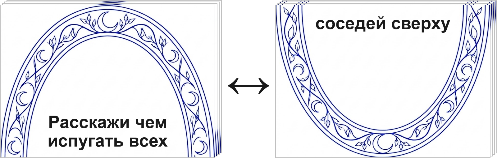
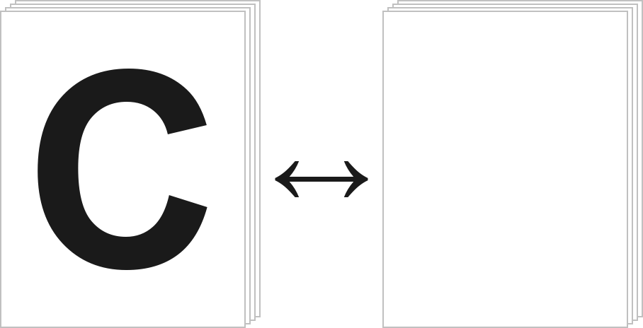
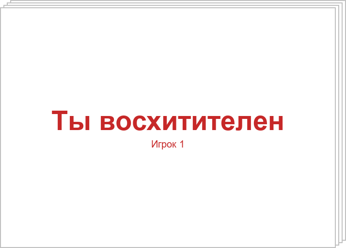
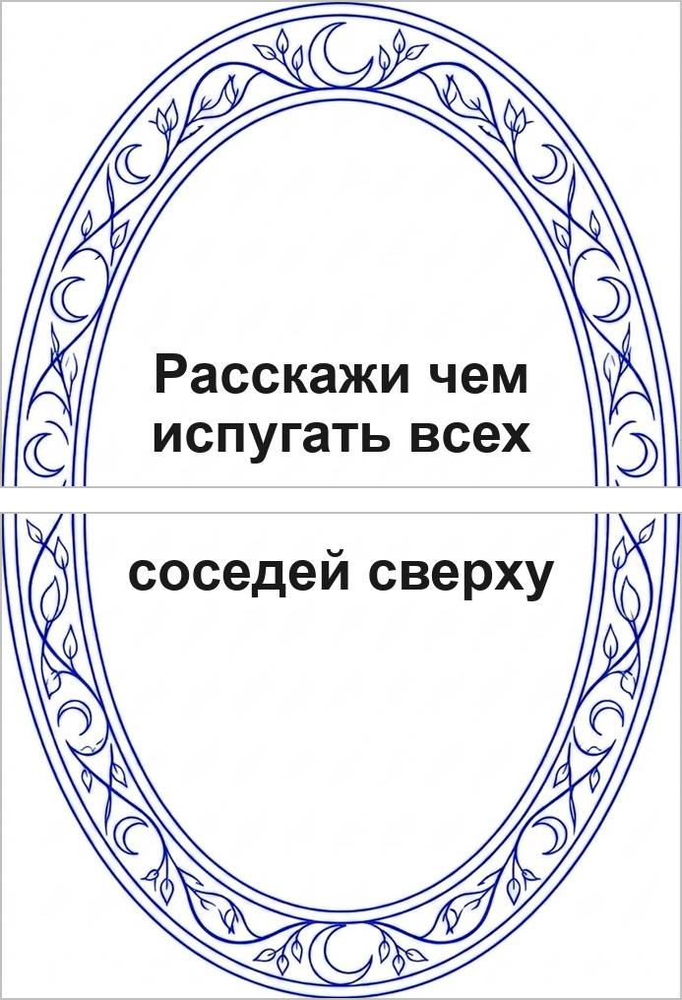

# Свет мой зеркальце. Правила игры

**Длительность партии:** около 30 минут  
**Количество игроков:** 3–6  
**Возраст:** 16+

*Вы – гремлины службы поддержки волшебного сервиса «Свет мой зеркальце скажи». Клиенты из почти современного мира задают через зеркало странные вопросы, а вы на лету собираете ответы из карт букв, которые берёте из общей кучи в центре стола. Чем смешнее и точнее реакция зала – тем выше шанс забрать карту запроса себе. Побеждает тот, у кого к концу колоды запросов больше всего таких карт.*

## Комплектация

карты запросов – 14 шт. (лицевая сторона и рубашка)

карты букв – 72 шт. (рубашка – джокер)

карты «Ты восхитителен» – 6 шт. (по 1 каждого цвета)

поверхность стола – 1 шт. (нет в PnP; нужна, чтобы раскидать карты букв и кидать карты «Ты восхитителен» к игрокам)

## Подготовка к игре

1. Перемешайте колоду карт запросов и положите её **рубашками вверх**. Верхняя карта колоды запросов показывает окончание будущего запроса на своей рубашке.
2. Каждый игрок выбирает цвет и берёт карту «Ты восхитителен» своего цвета. Лишние карты «Ты восхитителен» уберите в коробку.
3. Все карты букв раскиньте в случайном порядке **лицом вверх** в центре стола. Руки игроков в начале раунда пустые.

## Цель игры

Набирайте карты запросов как победные очки. Когда колода запросов больше не позволяет начать раунд, побеждает игрок с наибольшим числом таких карт.

## Как устроена карта запроса

У каждой карты запроса две стороны:

1. **Лицевая сторона** – начало фразы-запроса.
2. **Рубашка** – окончание фразы-запроса.

Рамка зеркала на всех картах запросов одинаковая: при любой перетасовке лицевая сторона одной карты запроса и рубашка следующей сверху карты в колоде всегда складываются в одно изображение зеркала с целым текстом запроса.

Читаете вслух, например: «Расскажи чем испугать всех соседей сверху».

## Ход игры

Игра идёт **раундами**. Все действия в раунде выполняются **одновременно**.

### Раунд

#### 1. Открытие запроса

Снимите верхнюю карту колоды запросов, переверните её **на лицевую сторону** и положите рядом с колодой так, чтобы вместе с **новой** верхней картой колоды запросов (с её рубашкой) получилось общее зеркало.

Прочитайте вслух текст на лицевой стороне открытой карты запроса и на рубашке верхней карты запроса.

Если карты кончились, наступает конец игры.

#### 2. Составление ответа

Игроки одновременно берут карты букв из центра стола и составляют из них ответ на запрос.

- Брать можно **только одной рукой** и **по одной карте** за раз. Второй рукой можно держать взятое, но не копаться в куче.
- Каждый берёт карты букв, пока ему **хватит на ответ**. Лишние карты букв остаются в центре стола.
- Ответ может быть одним словом или фразой – **на усмотрение игрока** в пределах взятых карт букв.
- Допускаются несуществующие и неполные слова.
- Любую карту буквы можно сыграть **рубашкой вверх** как джокер (любая буква). Лимита на джокеры нет, но игрок **не озвучивает** замену: слишком много джокеров обычно делает ответ нечитаемым, и такого игрока реже выбирают победителем раунда.
- Несыгранные взятые карты букв остаются у игрока до конца раунда.

Игрок выкладывает свой ответ перед собой на стол, когда готов.

*Пример: запрос «Чем соблазнить милф». Настя выложила «БЕЗ ТРУСОВ» (позже получит 3 голоса), Артём – «В ПОДЪЕЗДЕ» (1 голос), Кирилл – «МАМИН ДРУГ» (0 голосов).*

#### 3. Голосование

Каждый игрок берёт в руку карту голосования. Когда все определились с выбором, то по команде одновременно кидают на понравившееся слово (если очень хочется – можно в составившего его игрока). Если неясно, к кому упала – кинувший поясняет.

Себе карту голосования оставлять нельзя: кидайте только к чужому ответу.

В редком случае, если игрок не успевает кинуть карту голосования вместе с остальными, его карта не учитывается, а **каждый другой игрок получает по 2 голоса**.

Победитель раунда – игрок, перед которым оказалось **больше всего** карт голосования. Он берёт карту запроса, лежащую **лицевой стороной вверх**, и кладёт её перед собой как победное очко.

**Ничья по голосам.** Если лидеров несколько, все они объявляются победителями раунда. Один из них берёт лицевую карту запроса, остальные по очереди (по часовой стрелке от обладателя лицевой карты запроса или по договорённости) берут по одной карте **с верха колоды запросов** как победные очки. Часть будущих запросов при этом выбывает – так и задумано.

После определения победителя или победителей верните карты «Ты восхитителен» владельцам в руку – они снова понадобятся в следующем раунде.

#### 4. Возврат карт букв

После завершения раунда **все** карты букв (сыгранные, оставшиеся на руках и оставшиеся в центре стола) возвращаются в центр стола, перемешиваются и снова раскидываются **лицом вверх** в случайном порядке.

Затем начинается следующий раунд.

## Окончание игры и определение победителя

Игра заканчивается, когда колода запросов **больше не позволяет начать раунд**: карты кончились или осталась одна карта запроса без пары для зеркала.

Подсчёт:

1. Каждый игрок считает карты запросов, лежащие перед ним как победные очки.
2. Побеждает игрок с наибольшим числом таких карт.

При ничьей объявите совместную победу.

---

Версия правил 3.7

Контакты автора: t.me/tanion, vk.ru/tanion, yury@nxt.ru, +79213189331 (не стесняйтесь звонить / писать при возникновении вопросов)
